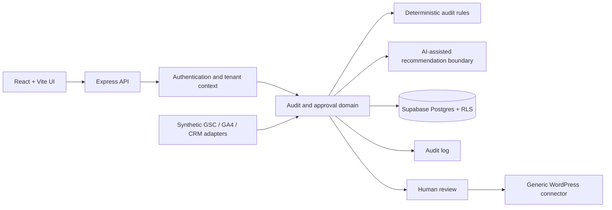

# SEO Intelligence Platform

A multi-tenant SEO analysis and recommendation platform that combines deterministic technical audits, analytics data, and AI-assisted recommendations with human approval workflows.

> This is a sanitized portfolio demonstration. Every company, URL, identifier, metric, and integration response is synthetic. AI does not autonomously publish website changes.

## 1. Overview

The project demonstrates how an SEO operations product can collect evidence, create deterministic findings, propose assisted recommendations, and require an authorized person to approve changes before a connector can publish them.

The runnable demo uses an in-memory store and synthetic adapters. A Supabase migration documents the intended persistent multi-tenant model and row-level security boundaries.

## 2. Problem

SEO work often combines crawler output, search analytics, web analytics, content review, and publishing tools. Without a shared workflow, evidence and decisions become difficult to trace. This platform organizes those steps around sites, audits, findings, recommendations, approvals, and immutable audit events.

## 3. Architecture



The demo API keeps data in memory so it runs without external credentials. The SQL migration is the reference design for production persistence.

## 4. Tech Stack

- React 19 and Vite
- Node.js and Express
- Supabase Postgres and Auth architecture
- PostgreSQL row-level security
- Node's built-in test runner
- GitHub Actions and Gitleaks

## 5. Domain Model

`Organization` owns `Site` records; sites contain `Page` records. An `Audit` produces evidence-backed `Finding` records. Findings produce `Recommendation` and `ProposedChange` records. Approval decisions and state transitions create `AuditLog` entries.

Every tenant-owned record carries `organization_id`. Tenant membership is checked in the application service and again through RLS in the database design.

## 6. SEO Audit Workflow

1. An authenticated actor creates an audit for a site in their organization.
2. The audit transitions from `queued` to `running`.
3. Deterministic rules evaluate the synthetic page observations.
4. Findings retain structured evidence.
5. Recommendations and proposed changes are generated.
6. The audit transitions to `completed` and records an audit event.

## 7. Deterministic Evidence Collection

The included rules demonstrate missing titles, short descriptions, missing H1 headings, non-indexable status codes, and thin content. Each rule stores the observed field and value rather than only a human-readable warning.

The demo crawler input is a fixture. Network crawling, robots handling, JavaScript rendering, and crawl-budget controls are future work.

## 8. AI-Assisted Recommendations

The recommendation boundary combines deterministic findings with a confidence score, rationale, and proposed value. The current runnable implementation is deterministic so it works without an AI provider.

An external model can later be introduced behind this boundary. Model output should remain advisory, schema-validated, and attributable to its source evidence.

## 9. Human Approval Workflow

Proposed changes begin as `pending-review`. Only `owner` and `reviewer` roles may approve them. Analysts can inspect evidence but cannot approve changes. The WordPress adapter rejects any change that has not reached `approved` status.

No background job or AI component can bypass this approval state.

## 10. GSC / GA4 Architecture

`SearchAnalyticsProvider` and `WebAnalyticsProvider` define small provider boundaries. The included adapters return synthetic query, landing-page, session, and conversion data. A real deployment would implement OAuth, encrypted token storage, provider quotas, and incremental synchronization outside the public demo.

## 11. WordPress Integration Architecture

`WordPressConnector` separates connection validation from publishing. The synthetic connector simulates an external identifier and timestamp only after approval. A real adapter would use narrowly scoped credentials, idempotency keys, retries, validation, and rollback metadata.

## 12. Multi-Tenant Security

The service layer resolves resources before operating on them and verifies that the actor's organization matches the resource organization. Cross-tenant audit creation and access are covered by tests.

Demo identity headers make local behavior easy to inspect; they are not production authentication. A production deployment should validate Supabase JWTs and derive tenant context from trusted membership records.

## 13. Supabase RLS

The migration enables RLS on all tenant-bearing tables. Membership permits reads within an organization, while approval updates require an `owner` or `reviewer` membership. Service-role credentials belong only on the backend and must never be exposed to the frontend.

## 14. Audit Logs and Traceability

Audit creation, completion, and change approval emit structured events containing organization, actor, entity, action, timestamp, and non-sensitive metadata. Production audit logs should be append-only and retained according to an explicit policy.

## 15. Synthetic Demo Data

The fictional tenant is **Example Home Services** at `https://example.com`. Example locations are Vancouver, Burnaby, and Richmond. Example services are Roof Repair, Gutter Cleaning, and Window Installation. All identifiers begin with `demo-`, and all displayed analytics values are invented.

## 16. Testing

The backend tests cover:

- tenant isolation;
- audit creation and lifecycle;
- deterministic finding generation;
- recommendation generation;
- authorization and least-privileged default role;
- approval and audit logging;
- synthetic analytics and CRM adapters;
- the publish approval gate.

Run `npm test` from the repository root after installing dependencies.

## 17. Running Locally

Requirements: Node.js 22+ and npm.

```bash
npm run install:all
cp backend/.env.example backend/.env
cp frontend/.env.example frontend/.env
npm start
```

In another terminal:

```bash
npm --prefix frontend run dev
```

The frontend demo is self-contained. API requests can use these explicitly synthetic headers:

```text
x-demo-user-id: demo-user-owner
x-demo-organization-id: demo-org-0001
x-demo-role: owner
```

## 18. Tradeoffs and Limitations

- The runnable demo uses in-memory persistence.
- Authentication headers are illustrative, not production authentication.
- The crawler evaluates supplied observations rather than fetching live sites.
- The recommendation engine is deterministic and does not call an AI provider.
- Background jobs are represented by lifecycle boundaries rather than a queue service.
- Integration adapters are synthetic and do not contact external providers.

These boundaries keep the demonstration reproducible and free from production credentials.

## 19. Privacy / Public Showcase Boundary

This repository was created independently as a public-safe demonstration. It contains no customer data, production reports, private prompts, production URLs, operational credentials, proprietary CRM adapter, or copied Git history. Provider integrations are represented only by generic interfaces and synthetic adapters.

No license is granted. This repository is provided as a portfolio and technical demonstration unless a license is added after ownership and IP status are explicitly confirmed.

## 20. Future Improvements

- Validate Supabase JWTs and add end-to-end Auth tests.
- Persist the workflow through Supabase repositories.
- Add a queue-backed crawler with rate and robots controls.
- Add schema validation and evaluation for AI output.
- Add idempotent publishing, validation, and rollback records.
- Add browser-level accessibility tests.
- Add observability for audit duration and adapter failures.

